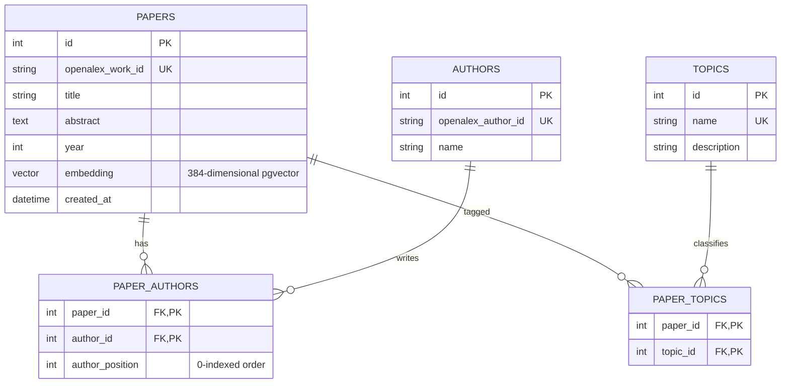

# Research Radar

An intelligent research paper search and discovery platform that indexes scientific papers, provides advanced filtering, and recommends semantically similar papers using local vector embeddings.

This platform is built for systems/platform engineering evaluation at ANRF AI PMU, IIIT Hyderabad.

---

## 🚀 Current Project Status
- **Current Phase:** Phase 1 (Schema + Migrations) Completed and Validated.
- **Next Phase:** Phase 2 (OpenAlex Ingestion script development).

For a detailed roadmap, see the [Master Plan](file:///Users/gunjankhadatkar/Aetheria/AI_works/research_radar/MASTER_PLAN.md).

---

## 🛠️ Tech Stack
- **Frontend:** Next.js (React)
- **Backend:** FastAPI (Python)
- **Database:** PostgreSQL with `pgvector` extension
- **Database Migrations:** Alembic
- **Embedding Model:** `sentence-transformers/all-MiniLM-L6-v2` (Local execution)
- **Containerization:** Docker & Docker Compose

---

## 📊 Database Schema (Phase 1 Design)

The database schema is designed with structured relational integrity to model papers, authors, and topics with many-to-many relationships:



### Table Definitions

1. **`papers`**: Stores paper metadata. Contains a `pgvector` column of dimension `384` for storing embeddings generated from the paper abstract using the `all-MiniLM-L6-v2` model.
2. **`authors`**: Stores author profiles with unique OpenAlex author IDs for idempotency.
3. **`topics`**: Custom-assigned high-level research areas (e.g. *"Large Language Models"*, *"Computer Vision"*).
4. **`paper_authors`**: Junction table with `author_position` to preserve authorship order when displaying papers.
5. **`paper_topics`**: Junction table linking papers to their topics.

---

## 🗄️ Migrations & Custom Indexes

Alembic is used to manage database migrations. The first migration (`698eb7bcff4d_create_papers_authors_topics_and_.py`) creates all tables and standard indexes, plus two crucial hand-added performance indexes:

1. **Full-Text Search Index (`ix_papers_fulltext`)**:
   - A functional **GIN** index built using:
     ```sql
     CREATE INDEX ix_papers_fulltext ON papers USING GIN (to_tsvector('english', coalesce(title, '') || ' ' || coalesce(abstract, '')));
     ```
   - Enables fast keyword search over titles and abstracts directly in Postgres without needing Elasticsearch or other heavy external search engines.

2. **Embedding Similarity Index (`ix_papers_embedding_cosine`)**:
   - An **ivfflat** approximate nearest-neighbor index:
     ```sql
     CREATE INDEX ix_papers_embedding_cosine ON papers USING ivfflat (embedding vector_cosine_ops) WITH (lists = 100);
     ```
   - Speeds up vector similarity lookup (`vector_cosine_ops`) for the semantic similarity feature using local embeddings.

---

## 💻 Local Setup & Database Migration Verification

To run database migrations locally, ensure you have a running PostgreSQL instance with `pgvector` installed, then follow these steps:

### 1. Backend Environment Setup
1. Navigate to the backend directory:
   ```bash
   cd backend
   ```
2. Create a virtual environment and activate it:
   ```bash
   python3 -m venv venv
   source venv/bin/activate
   ```
3. Install dependencies:
   ```bash
   pip install -r requirements.txt
   ```
4. Copy the environment template and set your connection details:
   ```bash
   cp .env.example .env
   # Update DATABASE_URL in .env if needed
   ```

### 2. Running Alembic Migrations
Run the upgrade command to apply migrations to your database:
```bash
alembic upgrade head
```

To roll back the migrations:
```bash
alembic downgrade base
```

---

## 📖 Reference Documentation
- [Project Brief](file:///Users/gunjankhadatkar/Aetheria/AI_works/research_radar/PROJECT_BRIEF.md)
- [Architecture](file:///Users/gunjankhadatkar/Aetheria/AI_works/research_radar/ARCHITECTURE.md)
- [Decisions Log](file:///Users/gunjankhadatkar/Aetheria/AI_works/research_radar/DECISIONS_LOG.md)
- [Tasks Checklist](file:///Users/gunjankhadatkar/Aetheria/AI_works/research_radar/TASKS.md)
- [Session Handoff](file:///Users/gunjankhadatkar/Aetheria/AI_works/research_radar/SESSION_HANDOFF.md)